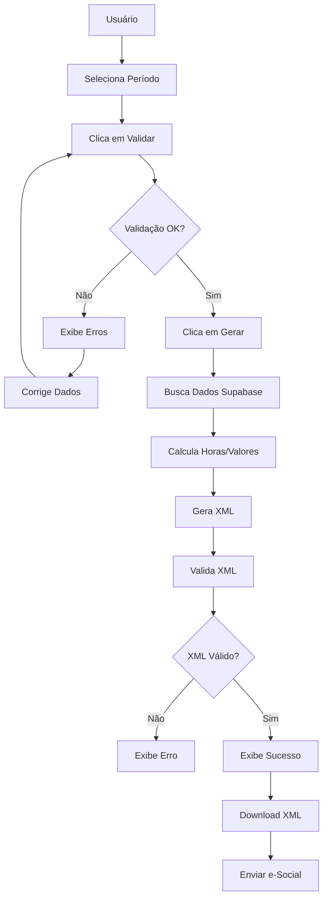

# Quickstart - Gerador de AEJ (e-Social)

## Início Rápido em 5 Minutos

### 1. Acessar a Interface

Navegue para:
```
https://seu-dominio.com/compliance/aej
```

Ou localmente:
```
http://localhost:3000/compliance/aej
```

### 2. Selecionar Período

1. Escolha o **Ano** (ex: 2024)
2. Escolha o **Mês** (ex: Janeiro)
3. Escolha o **Ambiente**:
   - **Homologação**: Para testes
   - **Produção**: Para envio oficial

### 3. Validar Dados

Clique em **"Validar Dados"** para verificar se:
- ✅ CNPJ está cadastrado
- ✅ Funcionários ativos existem
- ✅ CPFs estão cadastrados
- ✅ Há registros de ponto

Se houver erros, corrija-os antes de continuar.

### 4. Gerar AEJ

Clique em **"Gerar AEJ"**

O sistema irá:
1. Buscar dados do Supabase
2. Calcular horas trabalhadas e extras
3. Gerar XML conforme e-Social
4. Validar estrutura do XML

### 5. Download

Após geração bem-sucedida:
1. Clique em **"Download XML"**
2. Salve o arquivo (ex: `AEJ_12345678000190_012024.xml`)
3. Envie ao e-Social através do portal oficial

---

## Uso Programático

### Exemplo Básico

```typescript
import { AEJXMLGenerator } from '@/lib/compliance'
import { getTimeRecordsForAEJ } from '@/lib/supabase/queries/compliance'

// 1. Buscar dados
const data = await getTimeRecordsForAEJ(
  'company-id',
  '2024-01-01',
  '2024-01-31'
)

// 2. Gerar AEJ
const generator = new AEJXMLGenerator({
  environment: '2', // Homologação
  processVersion: '1.0.0',
  includeOvertimeDetails: true,
  includeMonetaryValues: true,
})

const result = generator.generate({
  ...data,
  startDate: new Date('2024-01-01'),
  endDate: new Date('2024-01-31'),
  referenceMonth: '2024-01',
})

// 3. Salvar XML
const blob = new Blob([result.xml], { type: 'application/xml' })
// ... download logic
```

### Exemplo Avançado com Validação

```typescript
import {
  AEJXMLGenerator,
  type AEJXMLConfig,
} from '@/lib/compliance'
import {
  getTimeRecordsForAEJ,
  validateCompanyForAEJ,
} from '@/lib/supabase/queries/compliance'

async function gerarAEJComValidacao(companyId: string, mes: string) {
  // 1. Validar empresa
  const validation = await validateCompanyForAEJ(companyId)

  if (!validation.valid) {
    throw new Error(`Erros: ${validation.errors.join(', ')}`)
  }

  // 2. Preparar período
  const [year, month] = mes.split('-')
  const startDate = new Date(parseInt(year), parseInt(month) - 1, 1)
  const endDate = new Date(parseInt(year), parseInt(month), 0)

  // 3. Buscar dados
  const data = await getTimeRecordsForAEJ(
    companyId,
    startDate.toISOString().split('T')[0],
    endDate.toISOString().split('T')[0]
  )

  if (!data.company) {
    throw new Error('Empresa não encontrada')
  }

  if (data.employees.length === 0) {
    throw new Error('Nenhum funcionário ativo')
  }

  // 4. Configurar
  const config: AEJXMLConfig = {
    environment: '2',
    processVersion: '1.0.0',
    includeOvertimeDetails: true,
    includeMonetaryValues: true,
  }

  // 5. Gerar
  const generator = new AEJXMLGenerator(config)

  const result = generator.generate({
    company: data.company,
    employees: data.employees,
    dailyRecords: data.dailyRecords,
    workSchedules: data.workSchedules,
    holidays: data.holidays,
    startDate,
    endDate,
    referenceMonth: mes,
  })

  // 6. Validar XML
  const xmlValidation = generator.validateXML(result.xml)

  if (!xmlValidation.valid) {
    throw new Error(`XML inválido: ${xmlValidation.errors.join(', ')}`)
  }

  return result
}

// Usar:
try {
  const aej = await gerarAEJComValidacao('company-uuid', '2024-01')
  console.log('✅ AEJ gerado:', aej.filename)
  console.log('Funcionários:', aej.totalEmployees)
} catch (error) {
  console.error('❌ Erro:', error.message)
}
```

---

## Checklist de Uso

### Antes de Gerar

- [ ] CNPJ da empresa cadastrado
- [ ] Funcionários ativos cadastrados
- [ ] CPF de todos os funcionários cadastrados
- [ ] Registros de ponto lançados no período
- [ ] Escalas de trabalho configuradas (opcional)
- [ ] Feriados cadastrados (opcional)

### Após Geração

- [ ] Validar XML gerado (automático)
- [ ] Fazer download do arquivo
- [ ] Testar em ambiente de homologação do e-Social
- [ ] Enviar para produção (se aprovado)
- [ ] Arquivar comprovante de recibo

---

## Ambientes

### Homologação (Ambiente 2)
- **URL**: https://webservices.envio.esocial.gov.br/ws/...
- **Uso**: Testes e validação
- **Certificado**: Não precisa ser válido
- **Dados**: Podem ser fictícios

### Produção (Ambiente 1)
- **URL**: https://webservices.producaorestrita.esocial.gov.br/ws/...
- **Uso**: Envio oficial
- **Certificado**: Deve ser válido (e-CPF ou e-CNPJ)
- **Dados**: Devem ser reais

**⚠️ IMPORTANTE**: Sempre teste em **Homologação** antes de enviar para **Produção**.

---

## Troubleshooting

### "Empresa não encontrada"
**Solução**: Verifique se o `companyId` está correto.

### "CNPJ inválido"
**Solução**: Cadastre o CNPJ no perfil da empresa (14 dígitos).

### "Funcionários sem CPF"
**Solução**: Cadastre o CPF de todos os funcionários ativos.

### "Nenhum registro de ponto"
**Solução**: Lance os registros de ponto do período desejado.

### "XML inválido"
**Solução**: Verifique os erros retornados e corrija os dados.

### "Erro ao buscar dados"
**Solução**: Verifique as permissões do Supabase e conexão.

---

## Exemplos de Respostas

### Sucesso

```json
{
  "xml": "<?xml version=\"1.0\" encoding=\"UTF-8\"?>...",
  "filename": "AEJ_12345678000190_012024.xml",
  "eventId": "ID1234567890123420240112345678",
  "totalEmployees": 15,
  "period": "2024-01",
  "receiptNumber": "R1706825472000"
}
```

### Erro de Validação

```json
{
  "valid": false,
  "errors": [
    "CNPJ inválido ou não cadastrado",
    "3 funcionário(s) sem CPF cadastrado"
  ]
}
```

---

## Fluxo Completo



---

## FAQ

### 1. Quantos funcionários posso processar?
**R**: Não há limite. O sistema processa todos os funcionários ativos.

### 2. Posso gerar AEJ de meses anteriores?
**R**: Sim, basta selecionar o ano e mês desejado.

### 3. O sistema envia automaticamente ao e-Social?
**R**: Não. O sistema gera o XML, mas você precisa enviar manualmente pelo portal do e-Social.

### 4. Posso customizar as rubricas?
**R**: Sim, mas isso requer alterações no código (ver documentação técnica).

### 5. O XML é válido segundo o e-Social?
**R**: Sim, o XML segue o layout oficial S-1.2 do e-Social.

### 6. Preciso de certificado digital?
**R**: Sim, para enviar ao e-Social você precisa de e-CPF ou e-CNPJ.

### 7. Onde vejo o histórico de arquivos gerados?
**R**: Futuramente será implementado um histórico no sistema.

### 8. Posso gerar AEJ de múltiplas empresas?
**R**: Sim, gere um AEJ para cada empresa separadamente.

---

## Próximos Passos

Após gerar o AEJ:

1. **Validar no Portal e-Social**
   - Acesse: https://www.gov.br/esocial
   - Faça login com certificado digital
   - Use "Validador eSocial" para testar o XML

2. **Enviar para Homologação**
   - Envie o XML no ambiente de homologação
   - Aguarde processamento
   - Verifique erros (se houver)

3. **Enviar para Produção**
   - Após aprovação em homologação
   - Envie no ambiente de produção
   - Guarde o número do recibo

4. **Monitorar Retorno**
   - Aguarde processamento (até 24h)
   - Verifique pendências
   - Corrija se necessário

---

## Suporte

Para dúvidas ou problemas:
- 📧 Email: suporte@rh-rickgay.com
- 📚 Documentação: Ver `RELATORIO_AEJ.md`
- 🐛 Issues: GitHub do projeto

---

## Versão

- **Versão**: 1.0.0
- **Data**: 2024-01-29
- **Compatibilidade**: e-Social S-1.2
